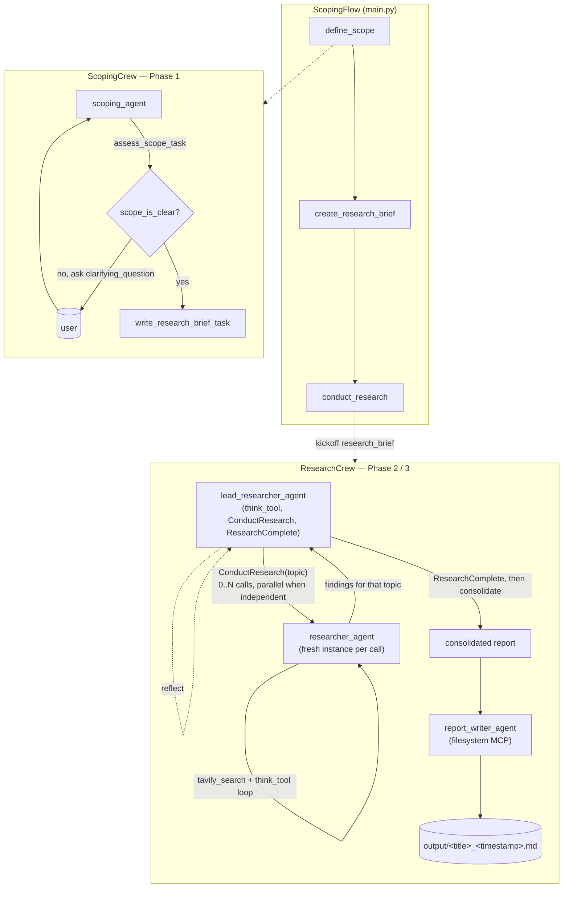
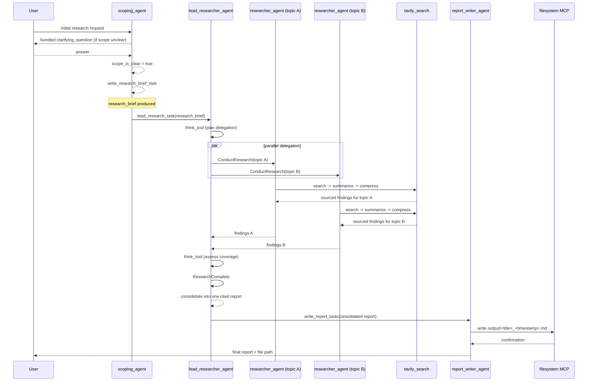

# Deep Research Flow

A CrewAI [Flow](https://docs.crewai.com/en/concepts/flows) that turns a raw,
possibly under-specified research request into a clarified brief, delegates
the actual research to a coordinating "lead researcher" agent that fans work
out to sub-agents, and writes a consolidated, source-cited report to disk.

Built incrementally in three phases — scoping (Phase 1), a single research +
report-writing agent (Phase 2), and the lead/sub-agent delegation pattern
plus result compression (Phase 3). `SESSION_NOTES_PHASE1.md`,
`SESSION_NOTES_PHASE2.md`, and `SESSION_NOTES_PHASE3.md` are a narrative log
of how those phases were built; this README documents the **current**
implementation as it stands now.

## Why this README has diagrams

`crewai flow plot` (via `crewai run` → `plot` script, or `uv run plot`) only
draws the Flow's own `@start`/`@listen` graph — three boxes, `define_scope →
create_research_brief → conduct_research`. It has no visibility into what
happens *inside* a `@listen` step: the crews, agents, and tools it kicks off,
and especially not the dynamic, LLM-decided delegation loop in Phase 3 (how
many sub-topics, whether they run in parallel). That's a structural limit of
the tool — there's no flag that makes it introspect Crew/Agent internals. The
diagrams below are hand-authored to show what the `plot` command can't.

## Architecture



The `researcher_agent` box inside `ResearchCrew` is drawn once, but at
runtime a **fresh `Agent` instance is created per `ConductResearch` call** —
never a shared one. This matters because crewai's tool executor runs
multiple native tool calls from the same LLM turn concurrently in a thread
pool, and `Agent.execute_task()` mutates non-thread-safe state on the
instance; reusing one `researcher_agent` object across parallel delegations
would corrupt that state. See `_build_researcher_agent()` /
`ConductResearchTool` below.

### A representative run (sequence view)

This shows one concrete path through the system — a request that ends up
splitting into two independent sub-topics researched in parallel:



## Current implementation

### Flow (`src/deep_research_flow/main.py`)

`ScopingFlow(Flow[ResearchScopeState])` has three steps:

1. **`define_scope`** — prompts for the initial request, then loops calling
   `ScopingCrew` until the scope is confirmed clear or `MAX_CLARIFYING_QUESTIONS`
   (3) rounds are used up (a `final_round_notice` is injected into the last
   round's prompt as a safety net, backed by an `or is_final_round` check in
   code).
2. **`create_research_brief`** — prints the confirmed `research_brief`.
3. **`conduct_research`** — kicks off `ResearchCrew` with the brief, today's
   date, a timestamp, and two tunables also read by the lead researcher's
   task: `MAX_CONCURRENT_RESEARCH_UNITS` (3) and `MAX_RESEARCHER_ITERATIONS`
   (3).

State (`ResearchScopeState`): `initial_request`, `conversation`,
`clarifying_questions_asked`, `research_brief`, `research_findings`.

### ScopingCrew — Phase 1 (`crews/scoping_crew/`)

One agent, two tasks, sequential:

- **`scoping_agent`** (`openai/gpt-4o`) — judges whether a request's subject,
  timeframe, and depth are clear enough to research.
- **`assess_scope_task`** — outputs a `ScopeAssessment` (`scope_is_clear`,
  optional `clarifying_question`). When unclear, it bundles *every* unclear
  dimension into a single message with multiple sub-questions rather than
  asking one thing at a time.
- **`write_research_brief_task`** — a `ConditionalTask` (only runs when
  `scope_is_clear`) that turns the full conversation into a first-person
  `ResearchBrief`, following six rules: maximize specificity; flag
  domain-relevant but unstated dimensions as open considerations, never as
  assumed preferences; never invent a preference; keep research scope
  distinct from user preferences; write in first person; and apply
  domain-specific sourcing rules (official/primary sources for
  products/travel, original papers for academic topics, LinkedIn/personal
  site for people, source language matching the request's language).

### ResearchCrew — Phase 2 / 3 (`crews/research_crew/`)

Two `@agent`s registered on the crew, plus one un-registered agent built on
demand:

- **`lead_researcher_agent`** (`anthropic/claude-sonnet-5`, `max_iter: 20`)
  — tools: `think_tool`, `ConductResearchTool`, `ResearchCompleteTool`. Runs
  **`lead_research_task`**: reflects with `think_tool` before delegating,
  breaks the brief into the smallest set of distinct sub-topics, delegates
  each via `ConductResearch` (multiple calls in the same turn when topics are
  independent — crewai actually executes those concurrently in a thread
  pool), reflects again after each round, calls `ResearchComplete` once
  satisfied, then produces the final consolidated, source-cited report
  itself (merging overlaps across sub-agents without ever dropping a unique
  source).
- **`researcher_agent`** (`anthropic/claude-sonnet-5`, `max_iter: 15`) — *not*
  a top-level crew agent. `ResearchCrew._build_researcher_agent()` constructs
  a fresh instance of it, with `[TavilySearchTool, think_tool]`, every time
  `ConductResearchTool` delegates a topic. It follows `conduct_research_task`'s
  template (search broadly → reflect with `think_tool` → narrow → stop within
  a 2–5 search-call budget) against the single `{research_topic}` it was
  given.
- **`report_writer_agent`** (`anthropic/claude-sonnet-5`, `max_iter: 8`) — no
  search tools; only a filesystem MCP server
  (`@modelcontextprotocol/server-filesystem`, scoped to the project's
  `output/` directory). Runs **`write_report_task`**: compiles the lead's
  consolidated report into markdown, invents a 2-3 word lowercase
  underscore-separated filename title, and writes it to
  `output/<title>_<timestamp>.md` using the exact timestamp passed in from
  the Flow (never one it generates itself).

Crew tasks (sequential, so each auto-receives all prior task output as
context): `lead_research_task` → `write_report_task`.

### Tools (`src/deep_research_flow/tools/`)

- **`think_tool`** — a `@tool`-decorated no-op reflection tool. Its only
  purpose is forcing a deliberate "pause and assess" step into an agent's
  tool-calling transcript; it's shared by both `researcher_agent` and
  `lead_researcher_agent`.
- **`TavilySearchTool`** (`tavily_search`) — a three-stage pipeline per call:
  1. Calls Tavily directly, **deduplicates results by URL**.
  2. **Summarizes** each result's raw content with `openai/gpt-4.1-mini`
     (structured via `response_model=WebpageSummary`).
  3. **Compresses** all of a call's summaries into one comprehensive,
     verbatim, per-sentence-cited findings report with `openai/gpt-4.1`,
     before returning that single block to whichever agent called the tool.
     Citations are enforced at the sentence/claim level (not once per
     source) via explicit prompt rules.
- **`ConductResearchTool`** (`ConductResearch`) — the lead researcher's
  delegation tool. Takes one `research_topic: str` (expected to be at least
  a paragraph); builds a fresh `researcher_agent` via a factory and runs it
  against a one-off `Task` templated from `conduct_research_task`, returning
  that sub-agent's raw findings.
- **`ResearchCompleteTool`** (`ResearchComplete`) — no arguments; signals the
  lead researcher to stop delegating and start consolidating. Does not end
  the agent loop itself (`result_as_answer` is not set) — the lead's next
  plain-text turn becomes the final consolidated report.

## Setup

```bash
cd deep_research_flow
crewai install        # or: uv sync
```

Populate `.env` with:

```
OPENAI_API_KEY=...       # scoping_agent, and TavilySearchTool's summarize/compress calls
ANTHROPIC_API_KEY=...    # researcher_agent, lead_researcher_agent, report_writer_agent
TAVILY_API_KEY=...       # TavilySearchTool
```

Tracing is enabled for this project (`crewai traces status` to confirm);
`crewai login` is required once per machine before traces show up on the AMP
dashboard.

## Running

```bash
crewai run                              # from a real interactive terminal — see note below
# or
uv run python -m deep_research_flow.main
```

`crewai run` needs a real TTY: its CLI internals do
`subprocess.run(["uv", "run", "kickoff"])` with no explicit `stdin=`, so it
inherits whatever stdin the parent process has. It fails with `EOFError` on
the first `input()` call if invoked through a non-interactive passthrough.

To view the (limited) Flow-level graph:

```bash
uv run plot   # generates crewai_flow.html — only shows the 3 @listen steps
```

## Known limitations / next steps

- The researcher sub-agent's search-call budget and the lead's delegation
  budget are prompt-only instructions, not code-enforced — a model can drift
  past the stated limits.
- Live end-to-end verification of parallel `ConductResearch` delegation
  (confirming crewai's thread-pool concurrency actually engages for a brief
  with independent sub-topics) is still pending, per the standing "batch
  live runs" workflow used throughout this project.
- Root `CLAUDE.md` (one directory up) still describes the repo as holding
  two independent projects — worth updating to mention `deep_research_flow`
  as a third.
